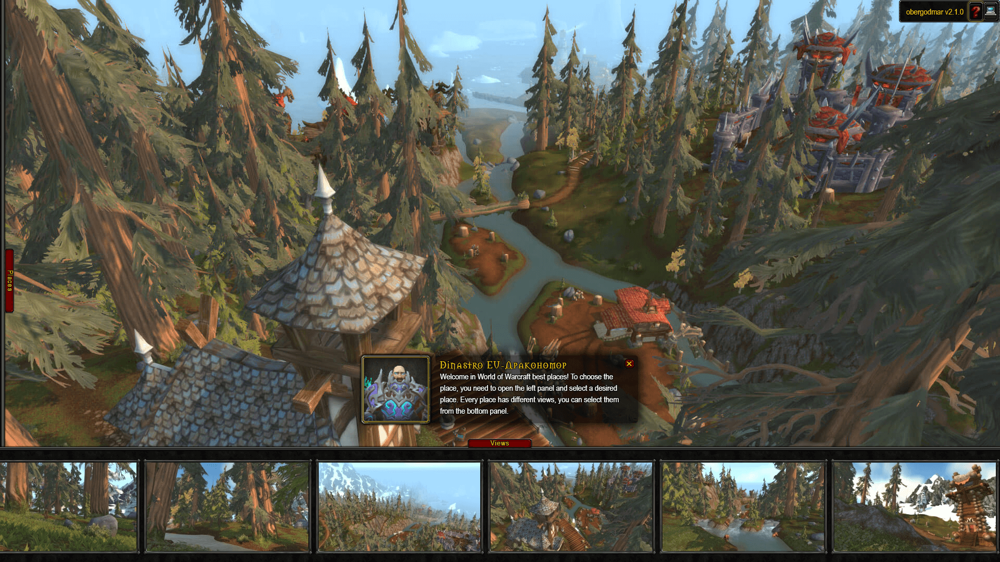
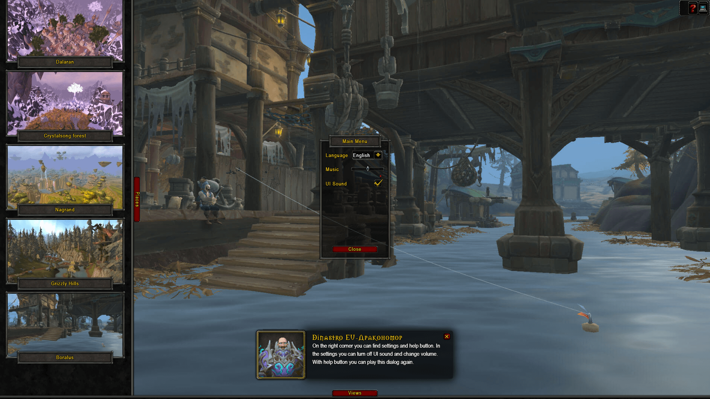
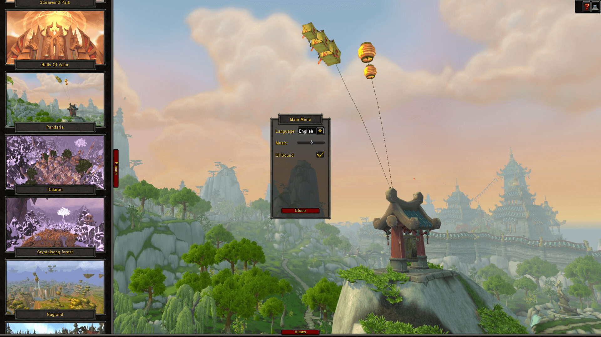

# World of Warcraft — Best Places

Explore iconic World of Warcraft locations with immersive scenery, original music, and a game-inspired interface. Available in English and Russian.

[Visit the website](https://wow-places.obergodmar.tech)

## Controls

- **Esc** — close an open scenery panel or toggle settings.
- **Space** — pause or resume music when the scene is focused.
- **Mouse/touch drag** — pan scenery and scroll panels.

## Screenshots

## Asset caching

Next.js computes a content hash of `public/media` and `public/fonts` at build time.
Versioned URLs receive a one-year immutable cache policy; original URLs retain their
default cache policy. Rebuild (or restart the dev server) after changing these files.
External media URLs retain the cache policy of their own host.

The initial HTML preloads core UI textures, the main font, and the requested scene.
Other scenes and audio are loaded on demand.
